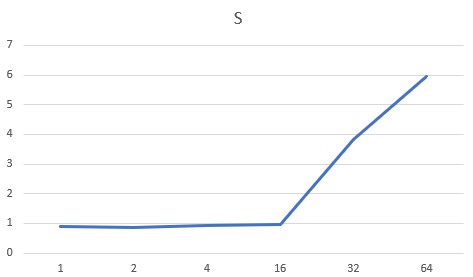
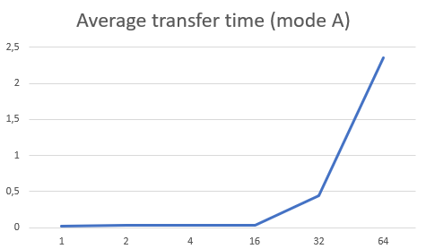
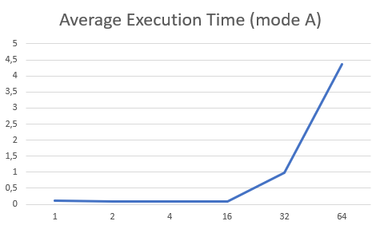
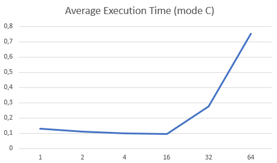
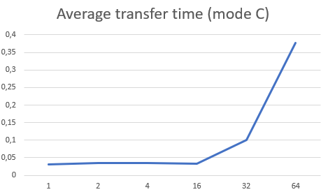

# High-performance-computing-systems
# Laboratory Work Report: Parallel Programming with MPI

## Introduction
This report presents the results of Laboratory Work No. 3, focused on developing parallel programs using the MPI (Message Passing Interface) technology. The task involved reversing the elements of each row in a two-dimensional array of size NxM, distributed across multiple processes for parallel computation.

## Task Description
Objective
- Reverse the order of elements in each row of a given NxM matrix using parallel computation with MPI.

Key Requirements
1. Input: A matrix stored in a file, with dimensions specified as command-line arguments.

2. Output: The matrix with each row reversed, displayed by the root process.

3. Parallelization: The matrix is divided among processes, with each process reversing its assigned rows.

## Algorithm and Implementation
### Block Diagram
The program follows a structured workflow:
1. Initialization: MPI is initialized, and process ranks are assigned.
2. Data Distribution:
- The root process reads the matrix from a file.
- Rows are distributed among processes using ```MPI_Scatterv```.
3. Computation:
- Each process reverses the elements of its assigned rows.
4. Data Collection:
- Results are gathered back to the root process using MPI_Gatherv.
5. Output: The root process prints the reversed matrix and execution metrics.

## Key MPI Functions Used
- ```MPI_Bcast```: Broadcasts matrix dimensions and distribution details to all processes.
- ```MPI_Scatterv```: Distributes rows of the matrix to processes.
- ```MPI_Gatherv```: Collects reversed rows back to the root process.
- ```MPI_Barrier```: Synchronizes processes before finalizing execution.
- ```MPI_Wtime```: Measures execution time for performance analysis.

## Execution and Results
### Workflow
1. Compilation: The program was compiled using mpicc and executed on a cluster with varying numbers of processes.
2. Input: A matrix file with dimensions 5000x5000 was used for testing.
3. Execution Modes:
- Mode A: Varied the number of processes (1, 2, 4, 16, 32).
- Mode C: Focused on larger process counts (up to 64).

### Performance Metrics

#### Mode A Results
| Processes (p) | Avg. Time (T) | Avg. Transfer Time (to) |
|---------------|--------------:|------------------------:|
| 1             | 0.116341      | 0.024614                |
| 2             | 0.095110      | 0.028591                |
| 4             | 0.093758      | 0.033091                |
| 16            | 0.090029      | 0.032027                |
| 32            | 0.990891      | 0.447726                |

#### Mode C Results (5000x5000 Matrix)
| Processes (p) | Avg. Time (T) | Avg. Transfer Time (to) |
|---------------|--------------:|------------------------:|
| 1             | 0.127478      | 0.031114                |
| 2             | 0.108999      | 0.035160                |
| 4             | 0.099906      | 0.035887                |
| 16            | 0.094484      | 0.033166                |
| 32            | 0.275218      | 0.100669                |
| 64            | 0.753609      | 0.377572                |

#### Key Observations
- Speedup: The program achieved significant speedup with up to 16 processes (e.g., 0.95618 for p=16 in Mode C).
- Overhead: For larger process counts (e.g., 32, 64), communication overhead (to) increased, reducing efficiency.
- Scalability: The algorithm scales well for moderate process counts but faces diminishing returns with excessive parallelism.

## Visualizations
### Mode A Performance Characteristics
#### Speedup graph

- Optimal performance was achieved with 16 processes (T = 0.090029s)
- Significant performance degradation occurs at 32 processes (T = 0.990891s)
- The optimum range for this mode is 4-16 processes.
#### Average Transfer Time (Mode A)

- Transfer time (to) shows linear growth up to 16 processes
- Dramatic 14x increase in overhead when scaling from 16 to 32 processes
- Communication becomes bottleneck at higher process counts
#### Average Execution Time (Mode A)

- Best performance at 16 processes (T = 0.094484s)
- 64-process configuration shows 8x slower performance than 16-process
- Demonstrates strong scaling up to mid-range process counts

### Mode C Performance Characteristics (5000×5000 Matrix)

### Average Transfer Time (Mode C)

- Transfer times remain stable (0.033-0.035s) for 1-16 processes
- Exponential growth in overhead beyond 32 processes
- Optimal balance between computation and communication at 16 processes

### Average Execution Time (Mode C)

- Best performance at 16 processes (T = 0.094484s)
- 64-process configuration shows 8x slower performance than 16-process
- Demonstrates strong scaling up to mid-range process counts

### Comparative Analysis
- Both modes show similar optimal process count (16)
- Mode C demonstrates better stability in transfer times
- Performance degradation more severe in Mode A at high process counts
- Larger matrix size in Mode C shows better absolute speedup potential